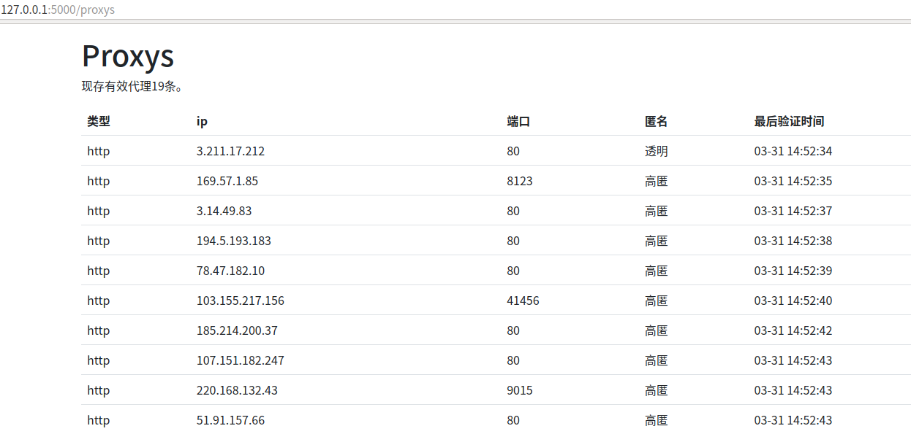

# free proxy免费代理服务

Public free proxys collected from internet.

通过收集互联网上公开的免费代理，经验证后，汇总入数据库。

## 一. 特点

1. 代理有效率可达90%
2. 全自动(自动添加有效代理,剔除失效代理)
3. 简单易用(通过flask提供了可供筛选的调用接口与前端查看页面)

## 二. 项目结构
    
    -|core
        -|checker.py    # 验证器
        -|db.py         # 数据库
        -|engine.py
        -|spider.py     # 爬虫基类
    -|spoders           # 各代理网站爬虫, 可手动添加其他网站
        -|ab57.py
        -|ip3366.py
        -|...
    -|templates 
        -|proxys.html   # 代理展示页面
    -|main.py
    -|configs.py
    -|logger.py
    -|examples.py       # 获取代理例子
    -|README.md
    -|requestments.txt

## 三. 安装与使用

(一) docker安装

为方便使用，提供了docker镜像文件(提供了全部源码以及镜像打包文件，可放心使用)
1) 安装[docker](https://docs.docker.com/get-docker/)
2) 下载freeproxy安装文件[freeproxy_1_0_0.zip](https://github.com/yatengLG/freeproxy/releases/download/v1.0.0/freeproxy_v1_0_0.zip)
3) 解压freeproxy_1_0_0.zip
4) 进入解压后文件夹，运行install.sh进行安装
5) 运行start.sh开启服务。(默认端口为5000，可通过'./start.sh port'指定端口)

(二) 源码安装

1) 下载[源代码](https://github.com/yatengLG/freeproxy/archive/refs/tags/v1.0.0.zip)
2) 解压v1.0.0.zip
2) 进入目录freeproxy-1.0.0
3) 安装依赖 'pip install -r requestments.txt'
4. python main.py

(三) 使用

开启服务后
1) 可通过访问 127.0.0.1:5000/proxys查看代理（端口可自行更改）
2) 通过post请求127.0.0.1:5000/get_proxy 随机获取代理
3) 数据库以及日志文件会保存start.sh脚本（docker安装）所占目录或main.py（源代码）所在目录

## 四. 说明

### 1.日志说明
    
    时间                       线程              线程名               
    2022-03-31 14:39:45,734 - 139634067355392 - auto check - INFO - Start check.
    2022-03-31 14:40:16,648 - 139634067355392 - auto check - INFO - ┌---------------------------------------┐
    2022-03-31 14:40:16,648 - 139634067355392 - auto check - INFO - |  valid  | invalid |  total  | cost/s  |
    2022-03-31 14:40:16,648 - 139634067355392 - auto check - INFO - |   19    |    3    |   22    |  30.91  |
    2022-03-31 14:40:16,648 - 139634067355392 - auto check - INFO - └---------------------------------------┘
    
    数据库中现有22个代理，有效19个，失效3个。
    
    2022-03-31 14:50:18,346 - 139634075748096 - auto crawl - INFO - ┌----------------------------------------------------------┐
    2022-03-31 14:50:18,346 - 139634075748096 - auto crawl - INFO - |     spider      |  new  | exist | total | rate |  cost   |
    2022-03-31 14:50:18,346 - 139634075748096 - auto crawl - INFO - |-----------------|-------|-------|-------|------|---------|
    2022-03-31 14:50:18,346 - 139634075748096 - auto crawl - INFO - |      AB57       |   4   |   2   |  135  | 0.04 | 471.86  |
    2022-03-31 14:50:18,346 - 139634075748096 - auto crawl - INFO - └----------------------------------------------------------┘
    
    从AB57代理网站，爬取获得135个代理，其中4个新的可用代理，2个可用但以存在于数据库中，该代理网站代理可用率为0.04，爬取验证该网站代理共耗时471秒。


### 2. 通过访问127.0.0.1/5000/proxys 查看当前现有代理。


### 3. 随机获取单个代理

```python
    import requests
    
    data = {'type': 'http',
            'anonymity': 'h'}   # 获取http代理的高匿代理
    
    c = requests.post('http://127.0.0.1:5000/get_proxy', data=data)
    print(c.text)
```
